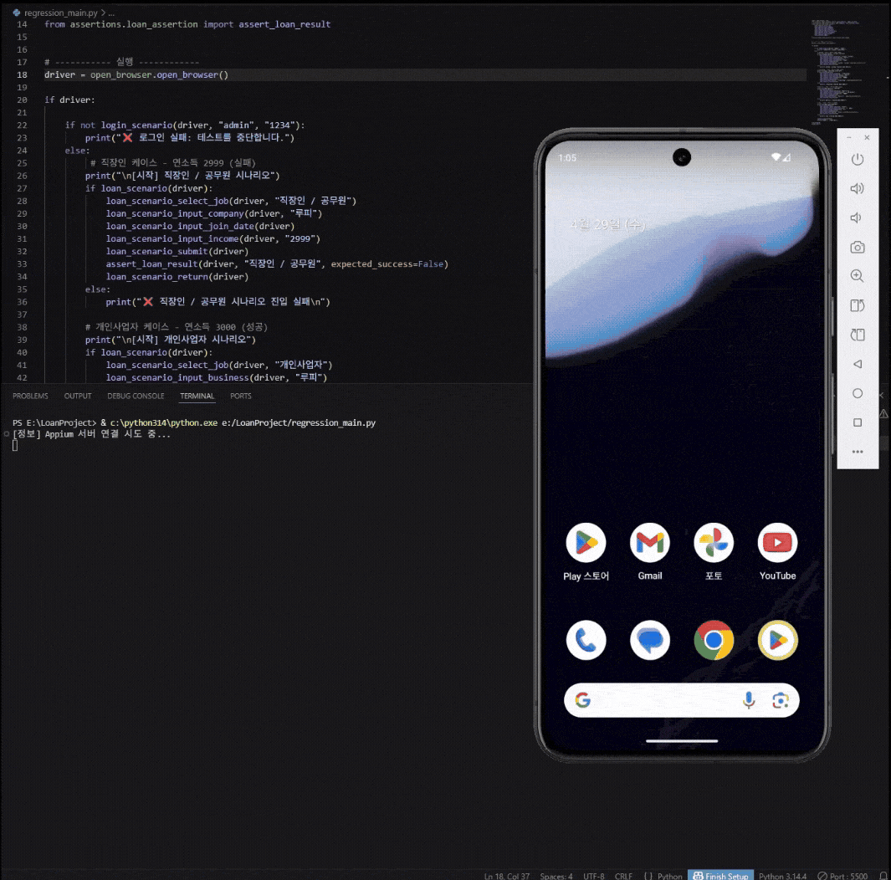
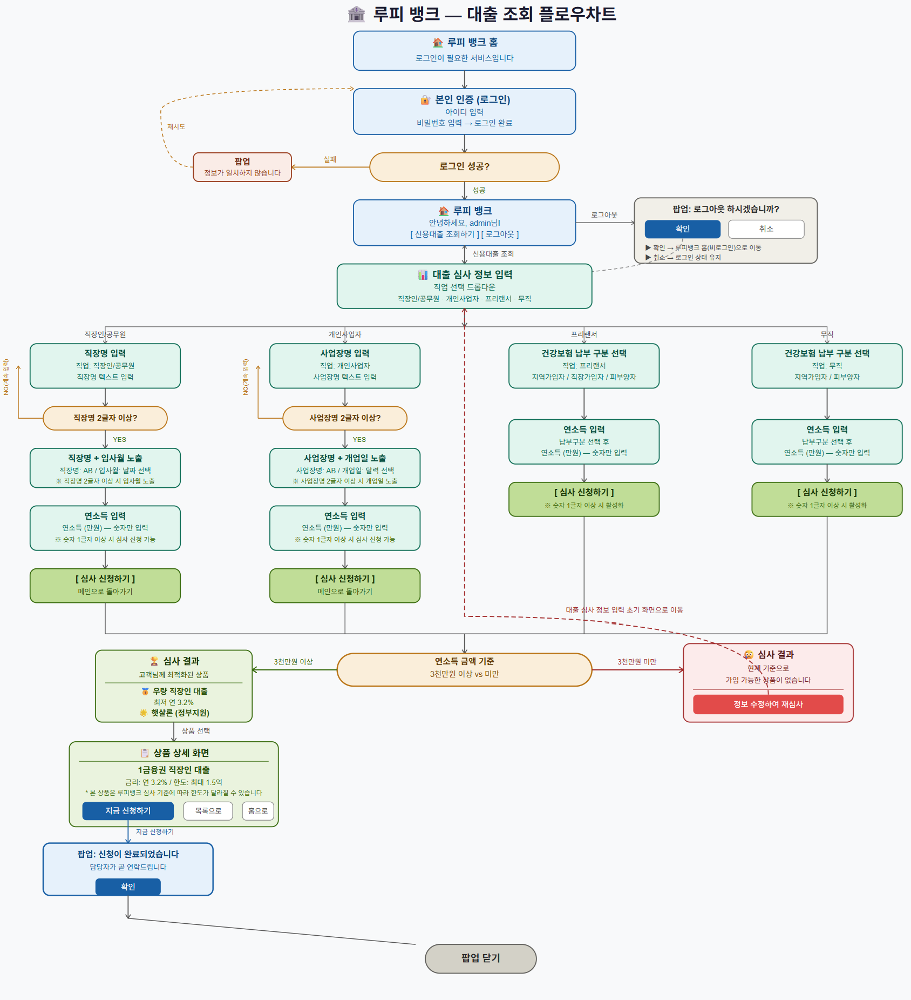

# 신용대출 심사 자동화 테스트 프로젝트

Appium과 Selenium을 활용한 하이브리드 앱 대출 시나리오 자동화 테스트 프로젝트입니다.

## 테스트 시연 (Demo)

<p align="center">
  
</p>

---

## 1. 주요 특징

### ✅ POM (Page Object Model) 디자인 패턴 적용
- **유지보수**: 페이지별(Login, Input, Result)로 객체를 분리하여 UI 변경 시 해당 페이지만 수정하면 되도록 설계했습니다.
- **가독성**: 테스트 시나리오와 저수준의 액션(Click, Input) 코드를 분리하여 비즈니스 로직을 한눈에 파악할 수 있습니다.

### ✅ 데이터 기반 테스트 (Data-Driven Test)
- **외부 데이터 관리**: 테스트 케이스를 `data/test_data.json`으로 분리하여 코드 수정 없이 케이스를 추가/변경할 수 있습니다.
- **자동 반복 실행**: `@pytest.mark.parametrize`를 활용해 JSON의 케이스 수만큼 테스트가 자동으로 생성됩니다.

### ✅ 하이브리드 앱 컨텍스트 제어
- **Native & Webview 스위칭**: 앱의 네이티브 버튼과 웹뷰 내부의 HTML 요소를 자유롭게 오가며 제어합니다.
- **유연한 탐색**: XPath와 CSS Selector를 상황에 맞게 활용하여 정확하게 요소를 타겟팅합니다.

### ✅ 예외 처리 및 검증 (Validation)
- **검증 로직**: 각 단계별로 성공/실패 여부를 판단하는 Validation 모듈을 구축했습니다.
- **에러 로깅**: 단계별 성공/실패 결과를 콘솔에 출력하여 실행 흐름을 추적할 수 있습니다.

---

## 2. 테스트 대상 앱 (루피 뱅크)

테스트 자동화의 대상이 되는 웹앱을 직접 제작했습니다. 로그인부터 대출 심사 결과까지 실제 금융 서비스 흐름을 구현했으며, 직업 유형별로 입력 필드와 심사 로직이 달라지는 복합적인 시나리오를 포함합니다.

- **직업 유형 4종**: 직장인/공무원, 개인사업자, 프리랜서, 무직
- **연소득 기준 심사**: 3,000만원 이상 승인 / 미만 거절
- **유효성 검사**: 직장명·사업장명 2글자 이상, 연소득 1글자 이상 입력 시 신청 활성화
- **팝업 처리**: 로그인 실패, 로그아웃 확인, 신청 완료 팝업

<p align="center">
  
</p>

---

## 3. 프로젝트 구조

```text
LOANPROJECT/
├── app/                        # [Target] 테스트 대상 웹앱 (직접 제작)
│   └── 대출조회_플로우차트.png   # 앱 비즈니스 로직 플로우차트
├── assertions/                 # [Validation] 결과 판정 로직
│   └── loan_assertion.py
├── data/                       # [Data] 테스트 케이스 데이터
│   └── test_data.json          # 시나리오별 입력값 및 기대결과 정의
├── scenarios/                  # [Scenario] 주요 테스트 시나리오 조각들
│   ├── loan_scenario.py
│   ├── loan_steps.py
│   └── login_scenario.py
├── images/                     # [Doc] README용 GIF 파일 보관함
├── report/                     # [Report] pytest 실행 결과 리포트
│   └── report.html
├── click_actions.py            # [Util] 공통 클릭 액션
├── input_actions.py            # [Util] 공통 입력 액션
├── open_browser.py             # [Util] 드라이버 설정 및 실행
├── validation.py               # [Util] 요소 확인 및 검증 유틸
├── regression_main.py          # [Runner] 순차 실행용 메인 파일 (레거시)
├── test_loan_regression.py     # [Runner] pytest 기반 데이터 드리븐 실행 파일
├── requirements.txt
└── README.md
```

---

## 4. 테스트 케이스 구성 (`data/test_data.json`)

케이스 추가 시 JSON 파일에 항목만 추가하면 코드 수정 없이 자동으로 테스트에 반영됩니다.

| Case ID | 직업 유형 | 연소득 | 기대 결과 |
|---------|----------|--------|---------|
| TC_01 | 직장인 / 공무원 | 2,999만원 | ❌ 거절 |
| TC_02 | 개인사업자 | 3,000만원 | ✅ 승인 |
| TC_03 | 프리랜서 | 3,000만원 | ✅ 승인 |
| TC_04 | 무직 | 0만원 | ❌ 거절 |

---

## 5. 테스트 결과 리포트

[](https://kimhy32500.github.io/LOANPROJECT/report/report.html)

> 위 링크 클릭 시 최신 pytest 실행 결과를 바로 확인할 수 있습니다.

---

## 6. 사전 준비 (Prerequisites)


- **Python 3.12.3+**
- **Appium Server** (v2.x 권장)
- **Android Emulator** (API 30 이상 권장)
- **ChromeDriver**: 에뮬레이터 내 Chrome 버전과 일치하는 드라이버

---

## 7. 설치 및 실행

```bash
# 저장소 클론
git clone https://github.com/kimhy32500/LOANPROJECT.git
cd LOANPROJECT

# 라이브러리 설치
pip install -r requirements.txt
```

### pytest 기반 실행 (권장)

```bash
# 기본 실행
pytest test_loan_regression.py -v

# HTML 리포트 생성
pytest test_loan_regression.py -v --html=report/report.html --self-contained-html
```

### 순차 실행 (레거시)

```bash
python regression_main.py
```

> ⚠️ **실행 전 주의사항**
> 1. **Appium Server**가 실행 중이어야 합니다. (기본 포트: 4723)
> 2. **Android Emulator**가 구동된 상태여야 합니다.
> 3. 에뮬레이터 내의 **Chrome 브라우저 버전**과 `webdriver-manager`가 관리하는 버전이 일치해야 합니다.